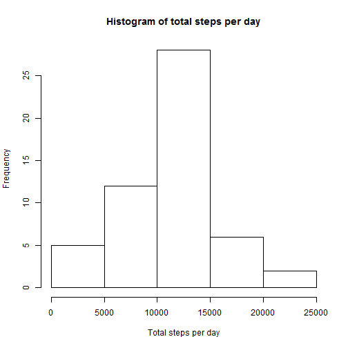
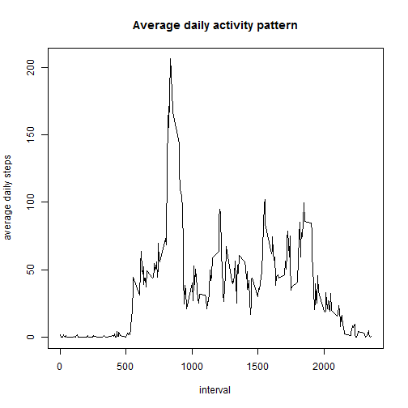
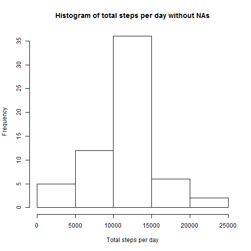
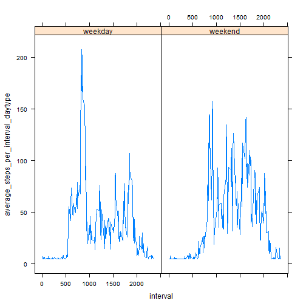

Reproducible Research: Assignment 1
====================================
author: "Alberto Campillo"
date: "Monday, September 14, 2015"
output: html_document?

## Q0. Loading and preprocessing the data

Show any code that is needed to

    * Load the data (i.e. read.csv())

    * Process/transform the data (if necessary) into a format suitable for your analysis

### Answer


```r
        data <- read.csv("activity.csv") # Load data
        data$date <- as.Date(as.character(data$date)) # Transform to date format
        library(dplyr) # Call to dplyr function, which I'll use later on
```

## Q1. What is mean total number of steps taken per day?

For this part of the assignment, you can ignore the missing values in the dataset.

    1. Make a histogram of the total number of steps taken each day

    2. Calculate and report the mean and median total number of steps taken per day
    
### Answer


```r
        steps_per_day <- summarize(group_by(data, date), sum(steps))
        colnames(steps_per_day) <- c("date", "total_steps")
        hist(steps_per_day$total_steps, xlab = "Total steps per day", main = "Histogram of total steps per day")
```

 

```r
        mean1 <- mean(steps_per_day$total_steps, na.rm=TRUE)
        show_mean1 <- formatC(mean1, format = "f", digits=1)
        median1 <- median(steps_per_day$total_steps, na.rm=TRUE)
        show_median1 <- formatC(median1, format = "f", digits=1)
```
    
    The average number of steps per day is 10766.2 and the median is 10765.0.
    
## Q2. What is the average daily activity pattern?

    1. Make a time series plot (i.e. type = "l") of the 5-minute interval (x-axis) and the average number of steps taken, averaged across all days (y-axis)

    2. Which 5-minute interval, on average across all the days in the dataset, contains the maximum number of steps?

### Answer


```r
        steps_per_interval <- summarize(group_by(data, interval), mean(steps, na.rm=TRUE))
        colnames(steps_per_interval) <- c("interval", "average_steps_per_interval")
        plot(steps_per_interval$interval, steps_per_interval$average_steps_per_interval, type="l", xlab = "interval", ylab = "average daily steps", main = "Average daily activity pattern")
```

 

```r
        max_interval <- steps_per_interval$interval[steps_per_interval$average_steps_per_interval == max(steps_per_interval$average_steps_per_interval)]
```

The 5-minute interval of the day where the daily average steps is maximum is at 835.

## Q3. Imputing missing values

Note that there are a number of days/intervals where there are missing values (coded as NA). The presence of missing days may introduce bias into some calculations or summaries of the data.

    1. Calculate and report the total number of missing values in the dataset (i.e. the total number of rows with NAs)

    2. Devise a strategy for filling in all of the missing values in the dataset. The strategy does not need to be sophisticated. For example, you could use the mean/median for that day, or the mean for that 5-minute interval, etc.

    3. Create a new dataset that is equal to the original dataset but with the missing data filled in.

    4. Make a histogram of the total number of steps taken each day and Calculate and report the mean and median total number of steps taken per day. Do these values differ from the estimates from the first part of the assignment? What is the impact of imputing missing data on the estimates of the total daily number of steps?

### Answer


```r
        nas <- sum(is.na(data$steps))
        perc_nas <- mean(is.na(data$steps))*100
        show_perc_nas <- formatC(perc_nas, format = "f", digits=1)
```

The total number of missing values in the dataset is 2304 (that represents 13.1% of the total).

The strategy I'll use to fill in missing values is replacing them with the overall step average


```r
        complete_data <- data # Create a copy of the data
        # Now, I substitute the NAs with the average number of steps
        complete_data[is.na(complete_data$steps), 1] <- mean(data$steps, na.rm=TRUE)
        # I'll now repeat what I did in Q1 with the new data (and calculate the differences)
        steps_per_day2 <- summarize(group_by(complete_data, date), sum(steps))
        colnames(steps_per_day2) <- c("date", "total_steps")
        hist(steps_per_day2$total_steps, xlab = "Total steps per day", main = "Histogram of total steps per day without NAs")
```

 

```r
        mean2 <- mean(steps_per_day2$total_steps)
        show_mean2 <- formatC(mean1, format = "f", digits=1)
        median2 <- median(steps_per_day2$total_steps)
        show_median2 <- formatC(median2, format = "f", digits=1)
        difference_mean <- mean2 - mean1
        show_difference_mean <- formatC(difference_mean, format = "f", digits=1)
        difference_median <- median2 - median1
        show_difference_median <- formatC(difference_median, format = "f", digits=1)
```

The new average number of steps per day is 10766.2 (difference of 0.0 with the original) and the median is 10766.2 (difference of 1.2 with the original). Thus, the impact of imputing missing data on the estimates of the total daily number of steps is very limited.

## Q4. Are there differences in activity patterns between weekdays and weekends?

For this part the weekdays() function may be of some help here. Use the dataset with the filled-in missing values for this part.

    1. Create a new factor variable in the dataset with two levels -- "weekday" and "weekend" indicating whether a given date is a weekday or weekend day.

    2. Make a panel plot containing a time series plot (i.e. type = "l") of the 5-minute interval (x-axis) and the average number of steps taken, averaged across all weekday days or weekend days (y-axis). 
    
### Answer


```r
        day <- weekdays(complete_data$date) # Figure out day of week
        complete_data <- cbind(complete_data, day) # Add this new variable to the data frame
        # Add a new variable figuring out if day is a weekday or a weekend ("sábado"" and "domingo"" are "Saturday"" and "Sunday"" in English)
        complete_data$day_type <- "weekday" 
        complete_data$day_type[complete_data$day == "sábado" | complete_data$day == "domingo" ] <- "weekend"
        # Now I calculate the average steps by interval and daytype and make the plot
        steps_per_interval_by_daytype <- summarize(group_by(complete_data, interval, day_type), mean(steps))
        colnames(steps_per_interval_by_daytype) <- c("interval", "day_type", "average_steps_per_interval_daytype")
        library(lattice)
        xyplot(average_steps_per_interval_daytype~interval | as.factor(day_type), data=steps_per_interval_by_daytype, type="l")
```

 
